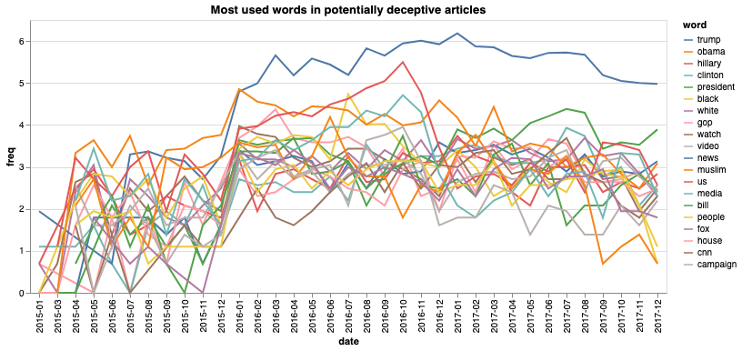

This is a visualization of a dataset of fake news (some details about its origin is omitted here just to further mislead you) and the words used in those fake news articles. 

If you are a liberal, my friend, take a look at this:

Want to know what's wrong with this representation?

if you are a conservative, my friend, look at this:

What's wrong with the representation?

Here's a more accurate representation of the dataset:

